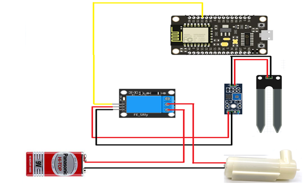
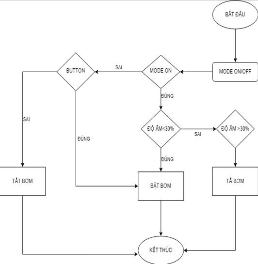
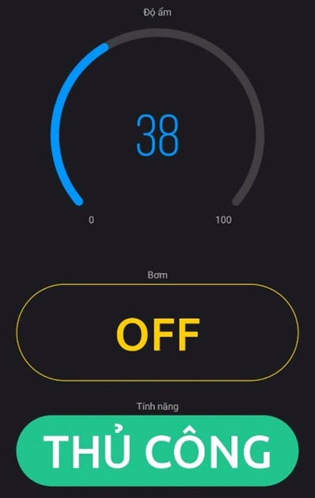
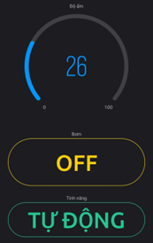

# 🌱 IoT Smart Plant Watering System using ESP8266 & Blynk

Hệ thống tưới cây tự động dựa trên **độ ẩm đất**, sử dụng **ESP8266 NodeMCU** và nền tảng **Blynk IoT**.  
Dự án cho phép **giám sát độ ẩm theo thời gian thực**, điều khiển **máy bơm nước từ xa** thông qua điện thoại với hai chế độ **Tự động** và **Thủ công**.

---

## 📖 Project Overview

Trong nông nghiệp truyền thống, việc tưới nước chủ yếu dựa vào kinh nghiệm và thao tác thủ công, dẫn đến lãng phí nước và hiệu quả không cao.  
Dự án này được xây dựng nhằm:

- Tự động hóa quá trình tưới cây
- Đảm bảo cây trồng luôn được cung cấp độ ẩm phù hợp
- Giảm công sức giám sát của người trồng
- Ứng dụng IoT vào nông nghiệp thông minh

---

## ✨ Features

- 📊 Đo và hiển thị độ ẩm đất theo thời gian thực  
- 🌐 Giám sát và điều khiển từ xa qua Internet  
- 💧 Tưới nước **tự động** khi độ ẩm thấp hơn ngưỡng cài đặt  
- 🎮 Chế độ **Manual / Auto** điều khiển bằng app Blynk  
- 🔔 Hiển thị trạng thái máy bơm trên điện thoại  

---

## 🧰 Hardware Components

- ESP8266 NodeMCU (Lua V3 – CH340)
- Cảm biến độ ẩm đất (Soil Moisture Sensor)
- Relay module 5V (KY-019)
- Máy bơm nước mini DC
- Nguồn DC (12V / 5V tùy cấu hình)
- Breadboard, dây jumper

---

## 💻 Software & Platform

- Arduino IDE
- Blynk IoT Platform
- Thư viện sử dụng:
  - `ESP8266WiFi.h`
  - `BlynkSimpleEsp8266.h`

---

## 🏗️ System Architecture

Sơ đồ tổng quan mô tả luồng hoạt động của hệ thống từ cảm biến đến ứng dụng Blynk.

---

## 🔌 Circuit Diagram

Sơ đồ mạch kết nối giữa ESP8266, cảm biến độ ẩm, relay và máy bơm.

---

## 🔁 Flowchart

Lưu đồ thuật toán điều khiển hệ thống tưới nước.

---

## 📱 Blynk Application Interface

Giao diện điều khiển và giám sát trên ứng dụng Blynk.

()

### Virtual Pins Configuration

| Virtual Pin | Chức năng |
|------------|-----------|
| V0 | Hiển thị độ ẩm đất |
| V1 | Chuyển chế độ Auto / Manual |
| V2 | Bật / Tắt máy bơm (Manual) |

---

## ⚙️ Working Principle

1. ESP8266 đọc dữ liệu từ cảm biến độ ẩm đất  
2. Giá trị độ ẩm được gửi lên Blynk thông qua WiFi  
3. Ở chế độ **Tự động**:
   - Nếu độ ẩm < ngưỡng → bật máy bơm
   - Nếu độ ẩm ≥ ngưỡng → tắt máy bơm  
4. Ở chế độ **Thủ công**:
   - Người dùng điều khiển trực tiếp máy bơm trên app  

---
## 👨‍💻 Team Members
Nguyễn Hồng Minh
Nguyễn Lê Gia Khiêm
Nguyễn Tuấn Kiệt
Nguyễn Công Hoàng Linh
Nguyễn Phước Đăng Minh
Phạm Minh Ngọc

